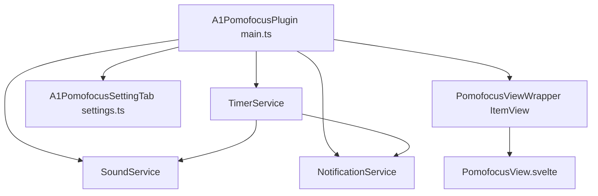

# A1 Pomofocus — Architectural Specification

<context>
For user documentation and usage instructions, please refer to: [_README.md](file:///c:/ObsidianDev/plugins/A1Pomofocus/_README.md).
</context>

## 1. System Overview & Architecture



### 1.1 Core Principles
- **Decoupled Business Logic**: The core timer state machine (`TimerService.ts`), sound engine (`SoundService.ts`), and notifications (`NotificationService.ts`) are completely decoupled from UI components.
- **Svelte Store Protocol**: `TimerService` implements the Svelte store contract (`subscribe`), enabling reactive updates in components without redundant polling loops.
- **Wall-Clock Absolute Synchronization**: Timer countdown is computed against an absolute timestamp (`Date.now() + remainingSeconds * 1000`), guaranteeing drift-free accuracy across process pauses.

---

## 2. Directory Layout
```
c:\ObsidianDev\plugins\A1Pomofocus\
├── manifest.json              # Obsidian plugin metadata
├── package.json               # Dependencies and scripts
├── tsconfig.json              # TypeScript configuration (ES2020)
├── esbuild.config.mjs         # Build pipeline + Zombie CSS copy plugin
├── _README.md                 # User guide and quick start
├── _Architecture.md           # Architecture specifications
└── src/
    ├── main.ts                # Plugin entry point & ItemView registration
    ├── settings.ts            # Native Obsidian PluginSettingTab
    ├── declarations.d.ts      # CSS and Svelte ambient declarations
    ├── styles.css             # Base leaf styling
    ├── models/
    │   └── types.ts           # Interfaces, modes, and default settings
    ├── services/
    │   ├── SoundService.ts    # Web Audio API oscillator synthesis
    │   ├── TimerService.ts    # Drift-free timer state machine
    │   └── NotificationService.ts # Windows + in-app notice dispatcher
    └── ui/
        └── PomofocusView.svelte # Main UI (Timer card + Task list)
```

---

## 3. Audio Synthesis Implementation
```typescript
// SoundService synthesizes sound using Web Audio API:
// Wood: Sine wave frequency ramp from 800Hz to 140Hz over 70ms with exponential gain ramp
// Bell: Dual-sine (880Hz + 1760Hz) with 500ms exponential decay
// Digital: Square wave (1046.5Hz) with 120ms sharp decay
```

---

## 4. Zombie CSS Protection Invariant
Obsidian only loads `styles.css` from the plugin directory. `esbuild.config.mjs` contains `copyCssPlugin` to ensure `main.css` is immediately copied to `styles.css` on every compilation pass.
