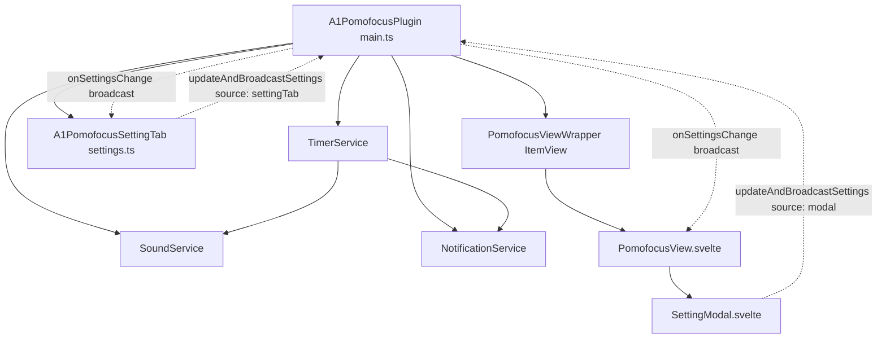

# A1 Pomofocus — Architectural Specification

<context>
For user documentation and usage instructions, please refer to: [_README.md](file:///c:/ObsidianDev/plugins/A1Pomofocus/_README.md).
</context>

## 1. System Overview & Data Flow



### 1.1 Data Movement Flow
1. **User Action**: The user edits a configuration option in either the **In-View Setting Modal** (`SettingModal.svelte`) or the native **Obsidian SettingTab** (`settings.ts`).
2. **Central State Mutation & Persistence**: The initiator invokes `plugin.updateAndBroadcastSettings(patch, source)`.
   - `Object.assign(this.settings, patch)` updates the in-memory singleton.
   - `await this.saveSettings()` asynchronously flushes to `data.json`.
3. **Timer Service Recalibration**: `TimerService.updateSettings(settings)` updates mode durations. If currently paused, it immediately resets `remainingSeconds` to the new mode duration and triggers `this.notify()`.
4. **Broadcast & UI Alignment**:
   - `PomofocusView.svelte` receives the event and updates its local reactive `settings` store, immediately updating color themes and display parameters.
   - `A1PomofocusSettingTab` receives the event. If `source !== "settingTab"`, it calls `this.display()` to re-render all input controls with the matching values. Keystrokes originating within the SettingTab skip re-rendering to preserve typing focus.

---

## 2. Directory Layout
```
c:\ObsidianDev\plugins\A1Pomofocus\
├── manifest.json              # Obsidian plugin metadata
├── package.json               # Dependencies and build scripts
├── tsconfig.json              # TypeScript compiler configuration (ES2020)
├── esbuild.config.mjs         # Bundler pipeline + Zombie CSS copy plugin
├── _README.md                 # Layered user guide and cheatsheet
├── _Architecture.md           # Architecture specifications & invariants
└── src/
    ├── main.ts                # Plugin lifecycle, settings broadcaster, ItemView wrapper
    ├── settings.ts            # Native Obsidian PluginSettingTab
    ├── declarations.d.ts      # CSS and Svelte ambient declarations
    ├── styles.css             # Base leaf styling
    ├── models/
    │   └── types.ts           # Domain models, mode types, and default settings
    ├── services/
    │   ├── SoundService.ts    # Web Audio API oscillator synthesis engine
    │   ├── TimerService.ts    # Drift-free timestamp-driven timer engine
    │   └── NotificationService.ts # Windows + Obsidian toast notification dispatcher
    └── ui/
        ├── PomofocusView.svelte # Primary Svelte view (Timer card + Task list)
        └── SettingModal.svelte  # Absolute-positioned modal settings dialog
```

---

## 3. Scope Boundaries

| Component | Responsible For | MUST NOT Contain |
| :--- | :--- | :--- |
| `A1PomofocusPlugin` | Lifecycle, settings broadcast SSOT, view registration, popout leaf trigger | Direct UI rendering, audio synthesis logic |
| `TimerService` | Absolute timestamp calculation, mode transitions, countdown tick loop | DOM manipulation, settings persistence IO |
| `SoundService` | Web Audio API node creation, decay envelopes, sound generation | File IO, timer state, UI bindings |
| `NotificationService` | HTML5 Notification API and Obsidian Notice toasts | Audio playback, timer state |
| `PomofocusView.svelte` | Timer visualization, interactive task operations, small window trigger | Audio synthesis math, standalone timer interval |
| `SettingModal.svelte` | In-view configuration editing and audio preview test | Direct file storage operations |
| `A1PomofocusSettingTab` | Native Obsidian settings panel integration | Duplicate audio synthesis engine |

---

## 4. Precise API Signatures

| Class / Method | Signature | Side-Effects |
| :--- | :--- | :--- |
| `Plugin.updateAndBroadcastSettings` | `(newSettings: Partial<PomofocusSettings>, source?: string) => Promise<void>` | Mutates `this.settings`, saves to disk, updates `TimerService`, emits to all listeners |
| `Plugin.onSettingsChange` | `(listener: (settings: PomofocusSettings, source?: string) => void) => () => void` | Registers listener in `settingsListeners` set; returns unsubscription callback |
| `TimerService.updateSettings` | `(newSettings: PomofocusSettings) => void` | Updates internal config; if paused, resets `remainingSeconds` and invokes `notify()` |
| `TimerService.start` | `() => void` | Sets `isRunning = true`, initializes `targetEndTime`, starts 200ms `setInterval` |
| `TimerService.pause` | `() => void` | Sets `isRunning = false`, computes remaining time from delta, stops interval |
| `SoundService.playSound` | `(type: SoundType, volumePercent: number, repeat: number) => void` | Instantiates/resumes `AudioContext`, schedules oscillator nodes |

---

## 5. Key System Invariants

### Invariant 1: Drift-Free Wall-Clock Synchronization
Timer countdowns MUST NOT accumulate tick-based drift. The remaining duration is calculated exclusively via:
`remainingSeconds = Math.max(0, Math.round((targetEndTime - Date.now()) / 1000))`
This ensures zero drift even when Obsidian is minimized, backgrounded, or restored from system sleep.

### Invariant 2: Zombie CSS Protection
Obsidian loads ONLY `styles.css` from the plugin directory. `esbuild.config.mjs` MUST retain `copyCssPlugin` to guarantee that `main.css` is mirrored to `styles.css` on every build step.

<!-- BEGIN USER-SPECIFIED -->
### Invariant 3: Dual-Settings Synchronization Contract
1. **Bidirectional Consistency**: The plugin exposes two parallel configuration surfaces:
   - The in-view **Setting Modal** (`SettingModal.svelte`), accessible inside the sidebar view and the detached Small Window.
   - The native **Obsidian SettingTab** (`settings.ts`), accessible via Obsidian `Settings -> Community Plugins -> A1 Pomofocus`.
2. **Zero-Lag Alignment**: Any setting changed in either surface MUST immediately propagate to:
   - The alternate setting UI (re-rendering inputs so values match across panes).
   - The active `TimerService` instance (immediately reflecting new durations on paused timer displays).
   - The persistent store (`data.json`).
3. **Typing Focus Protection**: When an update originates from `A1PomofocusSettingTab`, the broadcaster passes `source = "settingTab"`. The setting tab MUST NOT re-render its own DOM on its own inputs to prevent focus loss during active user typing.
<!-- END USER-SPECIFIED -->
