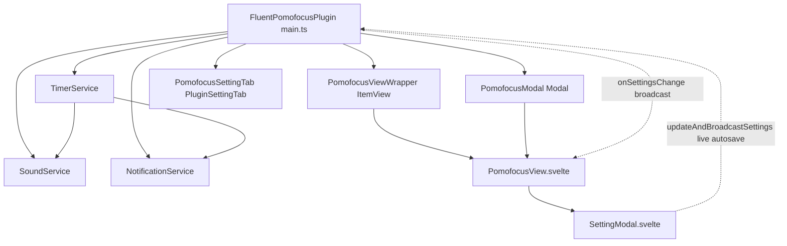

# Fluent Pomofocus — Architectural Specification

<context>
For user documentation and usage instructions, please refer to: [_README.md](file:///C:/ObsidianPublish/fluent-pomofocus/_README.md).
</context>

## 1. System Overview & Data Flow



### 1.1 Data Movement Flow
1. **User Action**: The user edits a configuration option inside the **In-View Setting Modal** (`SettingModal.svelte`) in the sidebar or Small Window, or via the Obsidian Settings tab (`PomofocusSettingTab`).
2. **Instant Autosave & Central Mutation**: The modal triggers `plugin.updateAndBroadcastSettings(patch, "modal")` (debounced on number inputs, instant on toggles/swatches/selects).
   - `Object.assign(this.settings, patch)` updates the in-memory singleton.
   - `await this.saveSettings()` asynchronously flushes to `data.json`.
3. **Timer Service Recalibration**: `TimerService.updateSettings(settings)` updates mode durations. If currently paused, it immediately resets `remainingSeconds` to the new mode duration and triggers `this.notify()`.
4. **Broadcast & UI Alignment**:
   - `PomofocusView.svelte` receives the event and updates its local reactive `settings` store, immediately updating color themes, task section visibility (`enableTasks`), and display parameters without requiring an Obsidian restart.

---

## 2. Directory Layout
```
C:\ObsidianPublish\fluent-pomofocus\
(Twin Junction: C:\ObsidianDev\plugins\fluent-pomofocus\)
├── manifest.json              # Obsidian plugin metadata
├── package.json               # Dependencies and build scripts
├── tsconfig.json              # TypeScript compiler configuration (ES2020)
├── esbuild.config.mjs         # Bundler pipeline + Zombie CSS copy plugin
├── _README.md                 # Layered user guide and cheatsheet
├── _Architecture.md           # Architecture specifications & invariants
└── src/
    ├── main.ts                # Plugin lifecycle, settings broadcaster, ItemView wrapper, SettingTab
    ├── declarations.d.ts      # CSS and Svelte ambient declarations
    ├── styles.css             # Base leaf and floating modal styling
    ├── models/
    │   └── types.ts           # Domain models, mode types, and default settings
    ├── services/
    │   ├── SoundService.ts    # Web Audio API oscillator synthesis engine
    │   ├── TimerService.ts    # Drift-free timestamp-driven timer engine
    │   └── NotificationService.ts # Windows + Obsidian toast notification dispatcher
    └── ui/
        ├── PomofocusModal.ts  # Floating modal container conforming to A1 floating standard
        ├── PomofocusView.svelte # Primary Svelte view (Timer card + Task list)
        └── SettingModal.svelte  # Absolute-positioned modal settings dialog
```

---

## 3. Scope Boundaries

| Component | Responsible For | MUST NOT Contain |
| :--- | :--- | :--- |
| `FluentPomofocusPlugin` | Lifecycle, settings broadcast SSOT, view registration, popout leaf trigger, command palette dispatcher | Direct UI rendering, audio synthesis logic |
| `TimerService` | Absolute timestamp calculation, mode transitions, countdown tick loop | DOM manipulation, settings persistence IO |
| `SoundService` | Audio buffer fetching, local vault caching, GainNode amplification, dynamic compressor, fallback synthesis | Timer state, UI bindings |
| `NotificationService` | HTML5 Notification API and Obsidian Notice toasts | Audio playback, timer state |
| `PomofocusModal` | Floating window lifecycle, native Obsidian Modal container, keyboard capture (Esc, Space shortcut) | Business countdown logic, audio synthesis |
| `PomofocusView.svelte` | Timer visualization, interactive task operations, small window trigger, in-modal close button | Audio synthesis math, standalone timer interval |
| `PomofocusSettingTab` | Obsidian Settings Tab surface, quick toggle for `enableTasks` and core options | Audio preview synthesis, custom slider rendering |
| `SettingModal.svelte` | In-view configuration editing, real-time autosave dispatch, audio preview | Direct file storage operations |

---

## 4. Precise API Signatures

| Class / Method | Signature | Side-Effects |
| :--- | :--- | :--- |
| `Plugin.openFloatingModal` | `() => void` | Instantiates and displays `PomofocusModal` floating window |
| `Plugin.updateAndBroadcastSettings` | `(newSettings: Partial<PomofocusSettings>, source?: string) => Promise<void>` | Mutates `this.settings`, saves to disk, updates `TimerService`, emits to all listeners |
| `Plugin.onSettingsChange` | `(listener: (settings: PomofocusSettings, source?: string) => void) => () => void` | Registers listener in `settingsListeners` set; returns unsubscription callback |
| `TimerService.updateSettings` | `(newSettings: PomofocusSettings) => void` | Updates internal config; if paused, resets `remainingSeconds` and invokes `notify()` |
| `TimerService.start` | `() => void` | Sets `isRunning = true`, initializes `targetEndTime`, starts 200ms `setInterval` |
| `TimerService.pause` | `() => void` | Sets `isRunning = false`, computes remaining time from delta, stops interval |
| `SoundService.playSound` | `(type: SoundType, volumePercent: number, repeat: number) => Promise<void>` | Plays cached decoded AudioBuffer or amplified synthesized fallback |
| `SoundService.preloadAll` | `() => Promise<void>` | Asynchronously caches sound files to local vault adapter `.obsidian/plugins/fluent-pomofocus/sounds/` |

---

## 5. Key System Invariants

### Invariant 1: Drift-Free Wall-Clock Synchronization
Timer countdowns MUST NOT accumulate tick-based drift. The remaining duration is calculated exclusively via:
`remainingSeconds = Math.max(0, Math.round((targetEndTime - Date.now()) / 1000))`
This ensures zero drift even when Obsidian is minimized, backgrounded, or restored from system sleep.

### Invariant 2: Zombie CSS Protection
Obsidian loads ONLY `styles.css` from the plugin directory. `esbuild.config.mjs` MUST retain `copyCssPlugin` to guarantee that `main.css` is mirrored to `styles.css` on every build step.

<!-- BEGIN USER-SPECIFIED -->
### Invariant 3: In-View Real-Time Settings & Autosave Contract
1. **Single Unified Surface**: Configuration is managed exclusively through the in-view **Setting Modal** (`SettingModal.svelte`), accessible inside both the sidebar view and detached Small Windows.
2. **Instant Live Autosave**: Any modified preference (timer durations, automation switches, alarm sound/volume/repeat, color themes, dark mode) takes effect immediately via `syncChanges` without requiring an Obsidian restart or manual OK button confirmation.
3. **Timer Recalibration**: Active paused states immediately recalibrate the countdown timer display to newly chosen mode durations.
4. **Clean Hit-Testing**: The modal explicitly avoids Chromium `backdrop-filter` rendering bugs by using clean RGBA backdrop layering and isolated pointer events.

### Invariant 4: Dual-Engine High-Fidelity Audio & Loudness Architecture
1. **Official High-Definition Samples**: Downloads and caches real acoustic audio for Wood (木鱼), Bell (清脆钟鸣), Bird (自然鸟鸣), Digital (电子闹铃), and Kitchen (机械闹钟) into vault storage (`.obsidian/plugins/fluent-pomofocus/sounds/`) for zero-latency offline playback.
2. **200% Gain Amplification & Dynamics Limiting**: Routes sound through `AudioContext` with `GainNode` scaling up to 2.0x and `DynamicsCompressorNode` (-12dB threshold, 10:1 ratio, 3ms attack) to ensure alerts are loud and crisp across low-power laptop speakers without clipping or distortion.
3. **Multi-Harmonic Synthesized Fallback**: If offline or before initial download finishes, instant synthesized multi-harmonic oscillators ensure notifications are never missed.
4. **Interactive Volume Control & Sequential Repeat Engine**: Setting modal provides 0-100% slider and repeat counter (1-10) with live preview on slider release, dropdown change, and number input. Playback employs an interruptible `onended` sequential repeat loop with a 100ms natural acoustic cadence, while `stopSound()` guarantees instant cutoff without overlapping when re-triggered or closed.

### Invariant 5: Native Obsidian Theme Harmony & Fluid Typography
1. **Default Native Theming**: Default `colorTheme` is `"obsidian"`, inheriting `var(--background-secondary)` for leaf backdrop, `var(--background-primary)` for card surfaces, `var(--interactive-accent)` for interactive controls and active tabs, and `var(--text-normal)` / `var(--text-muted)` for typography.
2. **Minimal Header**: Top bar omits redundant plugin brand titles to eliminate sidebar vertical clutter, reserving space purely for utility actions (`Small Window`, `Setting`).
3. **Sidebar-Adapted Scale**: Countdown display is proportioned to 56px, tabs to 12px, buttons to 38px, and card padding to 14-16px to prevent horizontal overflow and rigid visual dominance in narrow (250px-350px) sidebar leaves.
<!-- END USER-SPECIFIED -->

### Invariant 6: A1 Floating Modal UI Standard
1. **Window Dimensions & Positioning**:
   - Default with tasks: `width: 85vw`, `max-width: 680px`, `height: 85vh`, `max-height: 85vh` with a `12px` border radius, centered on the active screen viewport.
   - Widescreen golden ratio (without tasks): When `enableTasks` is disabled, the modal automatically transitions to `width: 640px` and `height: auto` (`min-height: 400px`), expanding the card to `560px` with prominent `84px` typography and vertically centered layout to eliminate empty dead space.
2. **Native Obsidian Modal Suppression**: Hides Obsidian's default `.modal-close-button` and uses an integrated top-right close icon (`✕`) inside the Svelte view header with clean hover responsiveness.
3. **Ergonomic Keyboard Shortcuts (Modal-Scoped)**:
   - `Escape`: Instantly dismisses the floating modal.
   - `Space`: Toggles start/pause for the active timer mode, automatically suppressed when typing inside inputs or when the settings modal is active.
   - `Ctrl + Tab` / `Ctrl + Shift + Tab`: Cycles timer modes right / left (`Pomodoro` ↔ `Short Break` ↔ `Long Break`) in capture phase without UI hint labels, strictly active only while the modal UI is open.

### Invariant 7: Total Task Decoupling (`enableTasks`)
1. **Conditional Mounting**: When `enableTasks` is toggled off, the entire task section (`.pomo-tasks`), task management buttons, and completion counters are unmounted from the DOM.
2. **Dual-Surface Configuration**: The toggle is exposed in both the in-view `SettingModal.svelte` and native Obsidian `PomofocusSettingTab`, propagating updates through `updateAndBroadcastSettings` for immediate reactive unmounting without reload.

